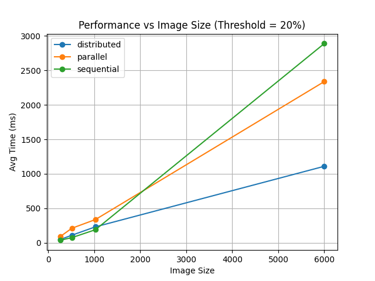
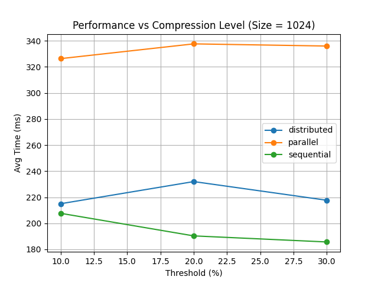

# Wavelet Transform-Based Image Compression

A Java application that compresses images using the **2D Haar Discrete Wavelet Transform (DWT)**. The project implements three execution modes — sequential, parallel (multi-threaded), and distributed (MPI) — allowing direct performance comparison across all three approaches.

---

## Table of Contents

- [About the Project](#about-the-project)
- [Architecture](#architecture)
- [How It Works](#how-it-works)
- [Execution Modes](#execution-modes)
- [Performance Results](#performance-results)
- [Requirements](#requirements)
- [Build & Run](#build--run)
- [Project Structure](#project-structure)

---

## About the Project

This project was developed as part of a university assignment on parallel and distributed computing. The core algorithm performs lossy image compression by applying a 2D Haar Wavelet transform, zeroing out small-magnitude coefficients (thresholding), and then reconstructing the image via the inverse transform.

The application supports loading `.jpg`, `.png`, and `.gif` images and displays the original alongside the reconstructed result in a Swing GUI.

---

## Architecture

```
src/main/java/
├── projectDWT/
│   ├── app/
│   │   ├── MainApp.java               ← Entry point (detects mode)
│   │   └── WaveletApp.java            ← Swing GUI (Sequential + Parallel)
│   ├── core/
│   │   ├── HaarWavelet2D.java         ← 2D Haar DWT (forward + inverse)
│   │   ├── WaveletPipeline.java       ← Common interface
│   │   ├── WaveletSequentialPipeline.java
│   │   ├── ParallelWaveletPipeline.java
│   │   ├── ImageRGB.java              ← RGB channel decomposition
│   │   └── MatrixUtil.java            ← Matrix helpers
│   └── distributed/
│       └── DistributedWaveletMPJ.java ← MPI distributed pipeline
└── util/
    └── Logger.java
```

---

## How It Works

1. **Load image** — the image is split into three independent float matrices: R, G, B.
2. **Forward DWT** — a 2D Haar transform is applied to each channel (horizontal pass, then vertical pass, repeated level by level).
3. **Thresholding** — wavelet coefficients whose absolute value falls below a configurable threshold are set to zero. A higher threshold means more coefficients are discarded → higher compression, lower quality.
4. **Inverse DWT** — the thresholded coefficient matrix is reconstructed back into pixel values.
5. **Merge channels** — the three reconstructed channels are combined into the output image.

---

## Execution Modes

### Sequential
Processes R, G, B channels one after another on the calling thread. Simple and predictable.

### Parallel
Uses a `FixedThreadPool` with one thread per CPU core. The three channels are submitted as separate tasks and processed concurrently. DWT, thresholding, and inverse DWT all run in parallel across channels.

> **Note:** For small images the parallel mode is slower due to thread-creation overhead. The advantage becomes significant at larger sizes (≥ 6000×6000 px).

### Distributed (MPJ Express / MPI)
Activated by passing `distributed` as a command-line argument. Uses `MPJ Express` (Java MPI binding) to distribute the work across multiple processes:
- Root process loads the image and broadcasts dimensions + threshold.
- Each rank receives its row slice via `Scatterv`.
- Horizontal DWT is performed locally on each rank.
- The matrix is transposed via `Alltoallv` so each rank can perform the vertical DWT on its column slice.
- Results are gathered back to root for reconstruction.

---

## Performance Results

Tests were run with threshold = 20% across multiple image sizes (3 runs each, values below are averages):

| Image Size | Sequential | Parallel | Distributed |
|------------|-----------|----------|-------------|
| 256×256    | ~38 ms    | ~90 ms   | ~48 ms      |
| 512×512    | ~76 ms    | ~212 ms  | ~111 ms     |
| 1024×1024  | ~190 ms   | ~338 ms  | ~232 ms     |
| 6000×6000  | ~2888 ms  | ~2337 ms | ~1109 ms    |

**Key observations:**
- Sequential is fastest for small images.
- Parallel and distributed modes win only at larger image sizes where parallelism overhead is amortized.
- Distributed mode provides the best scalability at high resolutions.

Performance graphs generated by `Testing.py`:

| Size test (threshold = 20%) | Threshold test (size = 1024) |
|---|---|
|  |  |

---

## Requirements

- **Java 21**
- **Maven 3.x**
- **MPJ Express** (required only for distributed mode) — place the MPJ `.jar` in `lib/` and configure the classpath accordingly

---

## Build & Run

### Build
```bash
mvn clean compile
```

### Run — GUI mode (Sequential / Parallel)
```bash
mvn exec:java -Dexec.mainClass="projectDWT.app.MainApp"
```
Or simply run `MainApp` from your IDE (IntelliJ, Eclipse, etc.).

### Run — Distributed mode (MPJ Express required)
```bash
mpjrun.sh -np 4 -cp target/classes:lib/mpj.jar projectDWT.app.MainApp distributed
```
Replace `4` with the number of MPI processes you want to use. The root process (rank 0) will open a GUI dialog for image and threshold selection.

### Run — Distributed mode from IntelliJ IDEA

1. **Download MPJ Express** (tested with `mpj-v0_44`) and note the path, e.g. `/home/Emir/Documents/mpj-v0_44`.

2. **Add the library** — go to `File → Project Structure → Libraries`, click `+`, and add the JAR:
   ```
   /home/Emir/Documents/mpj-v0_44/lib/mpj.jar
   ```

3. **Create a Run Configuration** — go to `Run → Edit Configurations → + → Application` and set:

   | Field | Value |
   |---|---|
   | **Main class** | `runtime.starter.MPJRun` |
   | **VM options** | `-jar /home/Emir/Documents/mpj-v0_44/lib/starter.jar projectDWT.app.MainApp distributed -np 8` |
   | **Environment variables** | `MPJ_HOME=/home/Emir/Documents/mpj-v0_44` |

4. Run the configuration. The root process (rank 0) will open a file chooser dialog — select an image and set the threshold to start distributed compression.

---

## Project Structure

```
.
├── src/                      ← Java source code
├── Testing.py                ← Python script to plot benchmark results
├── results.csv               ← Raw benchmark data
├── size_test.png             ← Performance vs image size chart
├── threshold_test.png        ← Performance vs compression level chart
├── MonaLisaTesting.gif       ← Test image
├── PikachuTesting.png        ← Test image
├── TriesteTesting1024x1024.jpg ← Test image
├── MountainsTesting.jpg      ← Test image
└── pom.xml
```

---
